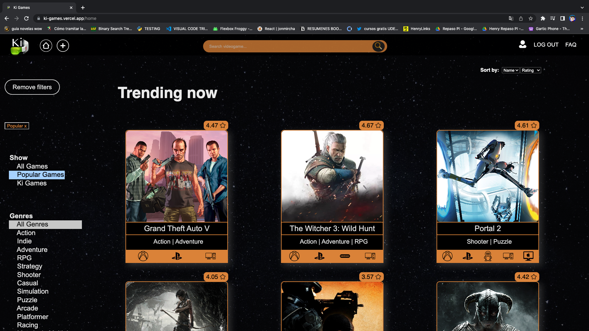

</img>

 

Hi everybody! I'm Joaquín, a front-end oriented developer with more than 8 years of accounting experience. I'm a creative person, passionate about music and stoicism. I love languages and learn how to communicate in different ways, that's one of the reasons why I became a programmer. Always coding, always learning 🤓 

<h3 align="left">Want to know more about me? Just connect!</h3>

 

## 💼 Languages, Tools and Frameworks

  
  
  
  
  

  
  
  
  
  

  
  
  
  
  
  

 

&nbsp;

## :pushpin: My proyects

<a href="https://ki-games.vercel.app/" target="_blank" rel="noreferrer"><h3>KI-GAMES</h3></a>

SPA (Single Page Application) about videogames entirely developed by me. Scripted in Javascript language, using React for the Front End and Redux as state management. All components were developed with pure CSS without the use of external libraries. The SPA consumes data from an API (RAWG) through a Back End developed in Node.JS using Express and Postman, adding new features to the original API. 

Some features of the project:
- Video games searches, sortings and multiple and combined filterings.
- Possibility to upload new video games by the user.
- Login demo using auth0.

Click on the title to check it out! 

  
  
  

  
  
  

 

<a href="https://salva-mi-huella.vercel.app/" target="_blank" rel="noreferrer"><h3>SALVÁ MI HUELLA</h3></a>

Web application development to promote animals adoptions and provide support to the shelters that are responsible for their care. Javascript language was used together with React for the Front End and Redux as state management. The Back End was developed in Node.JS using Express and Postman, and SCRUM methodology and Trello technology were used as the basis for the group organization. Different UX/UI libraries were used, such as mui/material, sweetalert2, apexcharts, among others.

My outstanding contributions in the project:
- Team leadership and organization through the planning and communication of daily tasks, both individual and groupal, aimed at customer satisfaction.
- Application identity and design.
- PayPal integration to make donations to shelters directly from the app.
- Auth0 integration for login and roles implementations for users, shelters and administrators profiles.
- Google Maps integration.
- Creation of a reward system by obtaining points for each donation made to exchange for products in the store.
- Charts functionality in the shelter's profile to view monthly information on adoptions and donations received.

  
  
  

 

  
  
  

 
&nbsp;

 

## 📣 How about a Stoic quote before you go?

> “The happiness of your life depends upon the quality of your thoughts.” 
>
> 
- Marcus Aurelius

